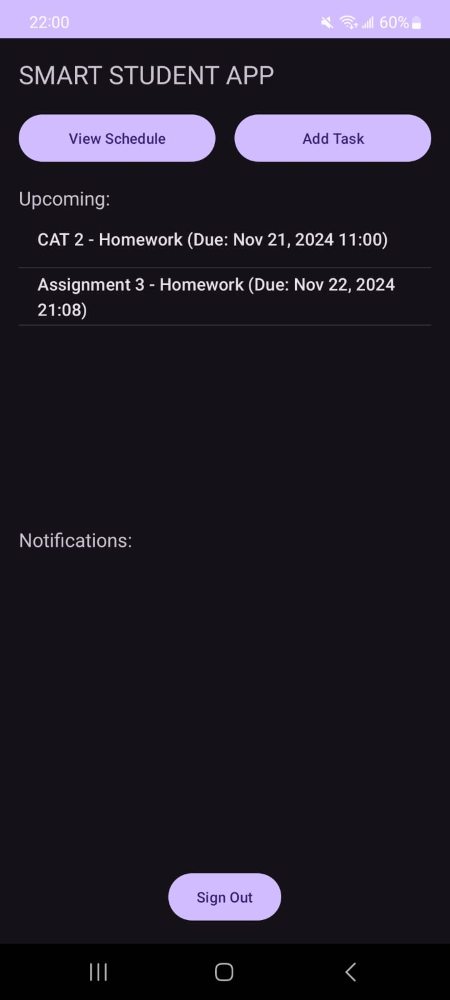
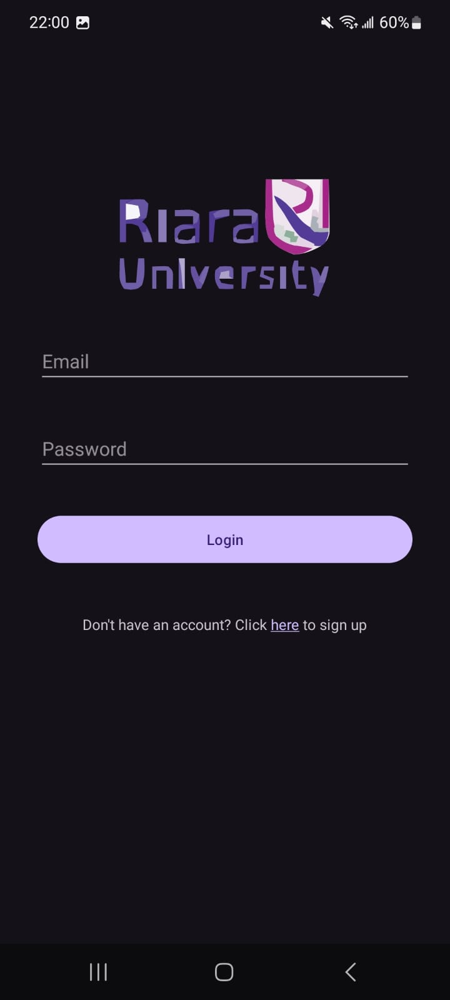
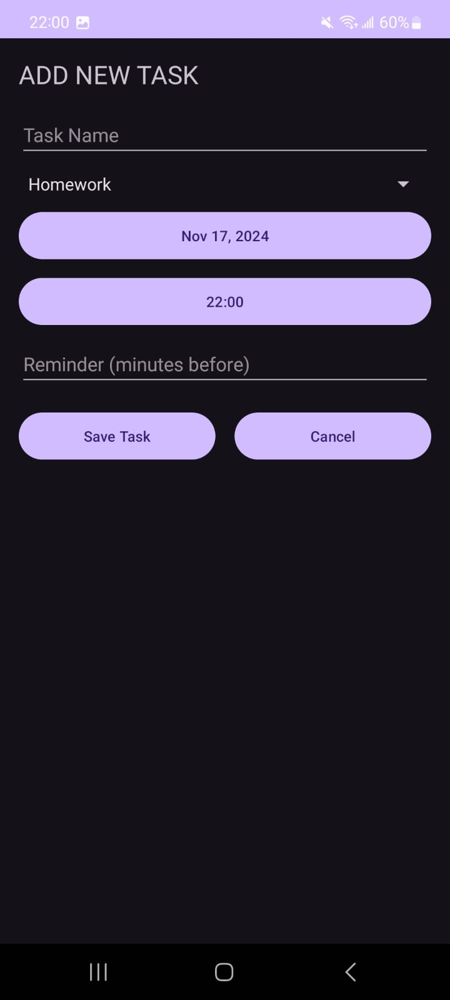
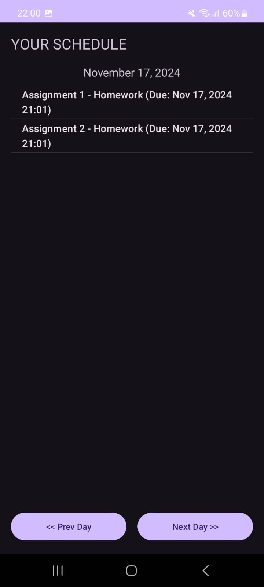

# Smart Student Reminder

## 1. Problem Statement

Students often struggle with managing their academic tasks, assignments, and deadlines effectively. The lack of a centralized, easily accessible system for task management leads to missed deadlines, increased stress, and poor academic performance. The **Smart Student Reminder App** addresses this problem by providing a user-friendly, mobile-based solution for task management tailored to students' needs.

## 2. Project Objectives

- Develop a user-friendly Android application for task management specifically designed for students.
- Implement secure user authentication using Firebase Authentication.
- Create a robust task management system with CRUD (Create, Read, Update, Delete) operations using Firebase Firestore.
- Implement task categorization and due date functionality to help students organize their academic workload.
- Develop a notification system to remind students of upcoming tasks and deadlines.

## 3. Project Implementation

### 3.1 Tool Knowledge

The Smart Student Reminder App was developed using the following tools and technologies:

1. **Android Studio 4.2.2**: The primary Integrated Development Environment (IDE) for Android app development.
2. **Java Programming Language**: The main language used for developing the Android application.
3. **Firebase**: Google's mobile platform for app development, used for authentication and data storage.
   - **Firebase Authentication**: For user sign-up and login functionality.
   - **Firebase Firestore**: For real-time data storage and synchronization.
4. **Git**: For version control and code management.

### 3.2 Project Development

**System Development Methodology**: Agile (Scrum)

The project followed an Agile methodology, specifically the Scrum framework. This approach allowed for iterative development and frequent reassessment of priorities. The development process was divided into two-week sprints, each ending with a potentially shippable product increment.

**Stakeholders**:

1. **Developer (Student)**: Responsible for designing, coding, and testing the application.
2. **Project Supervisor**: Provided guidance, reviewed progress, and ensured adherence to academic standards.
3. **End-users (Students)**: The target audience for the app, whose needs and feedback shaped the development process.

### 3.3 Attainment of Objectives

1. **User-friendly Android application**:

   - Developed an intuitive user interface with easy navigation and clear task visualization.
   - Implemented Material Design principles for a modern and consistent look.

   
   *Figure 1: User Interface demonstrating the task list and navigation.*

2. **Secure user authentication**:

   - Integrated Firebase Authentication for secure user sign-up and login.
   - Implemented email verification and password reset functionality.

   
   *Figure 2: Login screen showing Firebase Authentication integration.*

3. **Robust task management system**:

   - Created a `Task` class to represent individual tasks with properties such as name, type, due date, and reminder time.
   - Implemented CRUD operations using Firebase Firestore, allowing users to create, read, update, and delete tasks.

   
   *Figure 3: Task management screen showing task creation and editing.*

4. **Task categorization and due date functionality**:

   - Developed a task type spinner for easy categorization of tasks (e.g., Assignment, Exam, Project).
   - Implemented date and time pickers for setting due dates and reminder times.

   
   *Figure 4: Screen showing task categorization and due date setting.*

## 4. Implementation Challenges

### 4.1 Challenges

1. **Firestore query complexity**: Implementing efficient queries for task retrieval based on user ID and due date proved challenging.
2. **Real-time updates**: Ensuring that the task list updates in real-time when changes occur in the Firestore database was initially difficult.
3. **Background service reliability**: Keeping the notification service running consistently across different Android versions and device manufacturers presented challenges.

### 4.2 Resolutions

1. **Firestore query optimization**:

   - Created composite indexes in Firestore to support complex queries.
   - Implemented query caching to improve performance and reduce database reads.

2. **Real-time updates**:

   - Used Firestore's `addSnapshotListener` to listen for real-time changes in the database.
   - Implemented a `RecyclerView` adapter that efficiently updates the UI when data changes occur.

3. **Background service improvements**:

   - Used Android's `WorkManager` API to schedule periodic task checks, ensuring compatibility across different Android versions.
   - Implemented a boot receiver to restart the notification service when the device reboots.

## 5. Conclusions

The Smart Student Reminder App project successfully achieved its primary objectives:

1. A functional, user-friendly Android application was developed, providing students with an effective tool for managing their academic tasks.
2. Secure user authentication was implemented using Firebase Authentication, ensuring the privacy and security of user data.
3. A comprehensive task management system was created, allowing students to easily create, edit, and delete tasks.
4. Task categorization and due date functionality were successfully implemented, helping students organize their workload effectively.
5. A reliable notification system was developed, ensuring students receive timely reminders for upcoming tasks and deadlines.

This project demonstrated the practical application of Android development skills, Firebase integration, and software engineering principles in creating a real-world solution for student task management.

## Recommendations

Based on the development experience and user feedback, the following recommendations are proposed for future improvements:

1. **Implement a task-sharing feature** to allow students to collaborate on group projects and assignments.
2. **Develop a web version** of the application to provide cross-platform accessibility.
3. **Integrate with popular calendar applications** (e.g., Google Calendar) for better synchronization with other scheduling tools.
4. **Implement data analytics** to provide insights on task completion patterns and productivity trends.
5. **Add support for file attachments** to tasks, allowing students to link relevant documents or resources.

---

## The Future of the Project

The Smart Student Reminder App has significant potential for growth and expansion:

1. **AI-powered task prioritization**: Implement machine learning algorithms to suggest task priorities based on due dates, importance, and user behavior.
2. **Integration with Learning Management Systems (LMS)**: Develop plugins to automatically import tasks and deadlines from popular LMS platforms.
3. **Gamification elements**: Introduce point systems, achievements, and rewards to increase user engagement and motivation.
4. **Social features**: Create a community aspect where students can share study tips, form study groups, and motivate each other.
5. **Premium version**: Develop advanced features such as detailed analytics, unlimited file attachments, and priority support for a subscription-based model.

---

## References

- Android Developers. (n.d.). *Android Studio*. [https://developer.android.com/studio](https://developer.android.com/studio)
- Firebase. (n.d.). *Firebase Documentation*. [https://firebase.google.com/docs](https://firebase.google.com/docs)
- Agile Alliance. (n.d.). *What is Scrum?* [https://www.agilealliance.org/glossary/scrum/](https://www.agilealliance.org/glossary/scrum/)
- Goel, A. K., & Pirolli, P. (1992). *The structure of design problem spaces*. Cognitive Science, 16(3), 395-429.
- Schwaber, K., & Sutherland, J. (2020). *The Scrum Guide*. [https://scrumguides.org/scrum-guide.html](https://scrumguides.org/scrum-guide.html)
